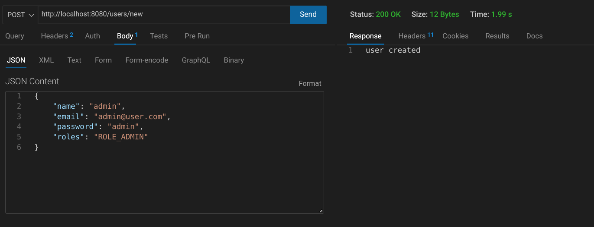
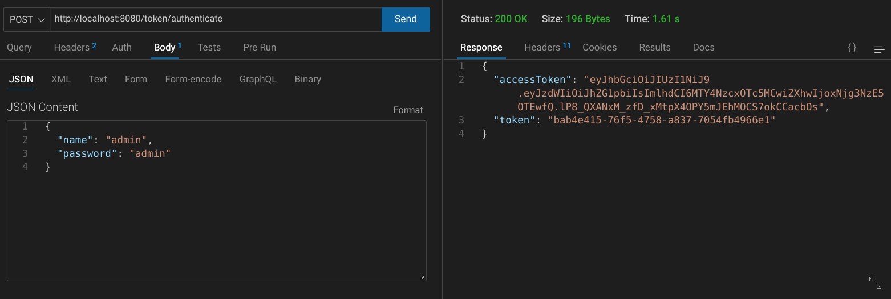
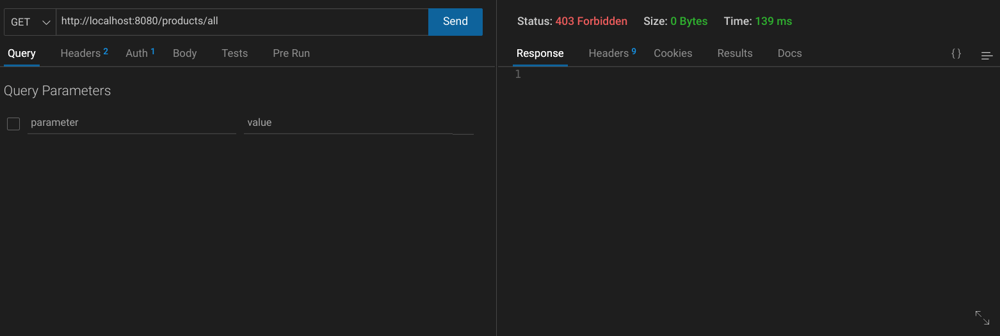
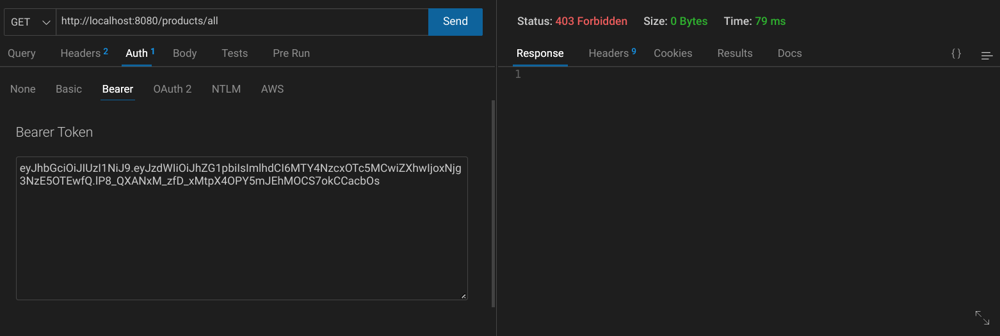
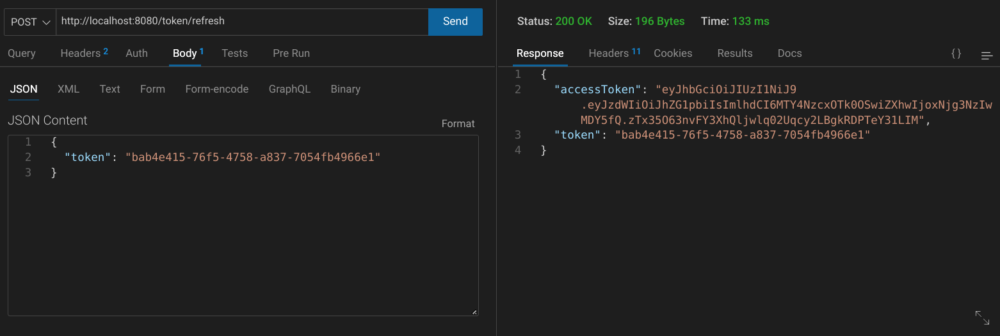
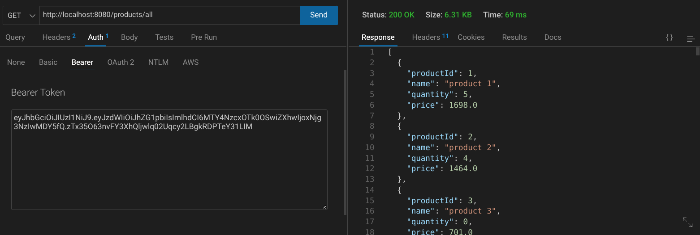
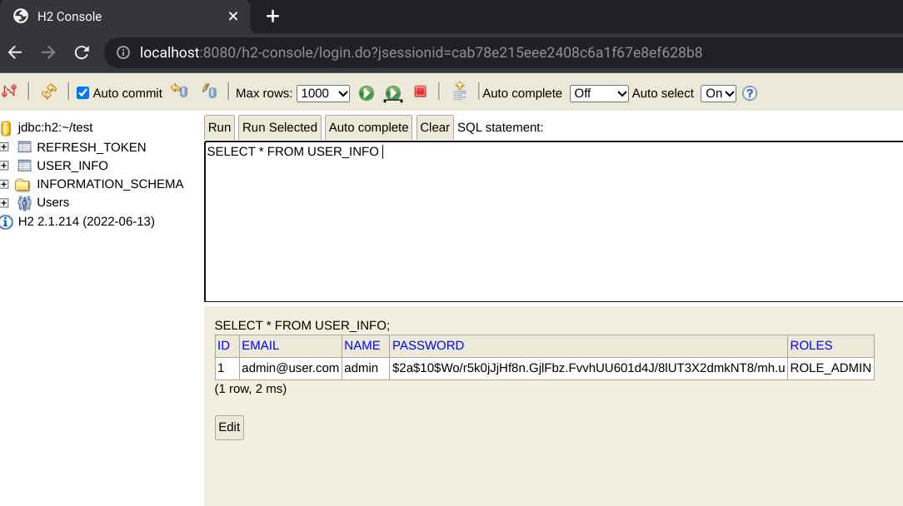
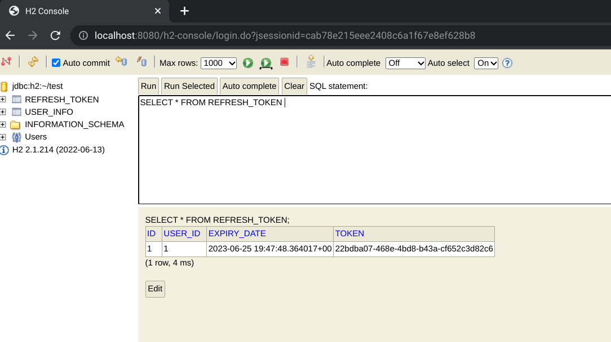

# Spring Auth JT

This is reworked from a Spring Boot Authentication series that starts with this [tutorial](https://www.youtube.com/watch?v=R76S0tfv36w), which is expanded upon further with [JWTs](https://www.youtube.com/watch?v=NcLtLZqGu2M) and [Refresh Tokens](https://www.youtube.com/watch?v=Wp4h_wYXqmU).

Some shortcuts were taken in the tutorial, and I have tried to undo some bad practices. The video series is worthwhile as a starting point, and I have used it to give me some context on prior Spring Boot authentication implementation practices. Even though the videos are fairly recent, some implementation details are now out of date. Implementation details do change fairly frequently, and it helps to be aware of the various past implementations to help convert to newer practices. Most of the changes were confined to the Spring Configuration implementation.

Unlike the video, I have used h2-console and made the necessary tweaks to have h2-console work with Spring Security.

## Screenshots

***

***

***

***

***

***

***

***

***

## Thoughts
 
- The `authorizeHttpRequests()` method has changed; it takes a lambda, and you set the allowed routes as the return object.
- The new implementation helps eliminate chaining and having to use `.and()`.   
- `formLogin()` was deprecated and changed to use the same pattern as authorizeHttpRequests().
- VS Code didn't suggest an import for `withDefaults()`.
- "ROLE_" is a hassle that has to be accounted for when setting up role access.  However, hasRole does prepend "ROLE_" to the string you pass it.  
- name vs. username variable: better to have the variable match the entity field name (unless not possible) ?  
- Slight differences in route names from the second video to the third video.  `/new` was changed to `/signup` and `/authenticate` was changed to `/login`.  
- 302 Error Code on users/new post requests if you don't disable CSRF.
- Using h2-console with Spring Security can be problematic. You need to disable headers, allow access to the routes, and worry about x-frame-options (iframe will be denied).
- When you are logged in as an admin user and go to a user role protected route, the error message is 403, but the fallback error page still appears.
- The refresh token string would need to be saved on the frontend and then you would send a request to the backend when the token is close to its expiration time. 
-  The`allkeysgenerator` website was not working when I checked, so I used an `openssl` command to generate the secret key for the JWT. It is better to put the secret key inside the application properties file and use an environment variable to access it. This can be done with an annotation.

## Continued Development

- Some endpoints just return `String`.  This causes problems in the frontend, as you usually need json.  You can change endpoints to use a `ResponseEntity` or you can create a standard response class that you can use for all endpoints.   
- Roles should not be passed on login.  Role can be set inside the `addUser` method.  If you do it this way, an admin user would probably have to be set by directly manipulating the database.    
- `AuthRequest` should use email instead of name.  
- Validation.  Email or name have to be unique.  
- JWT Secret has to be hidden.  
- Poor Lombok usage.  I think @Entity and @Data are problematic together.  `@Data` can generate poor `toString`, `equals` and `hashCode` methods.  See [Stack Overflow](https://stackoverflow.com/questions/40516058/lombok-data-and-builder-on-same-entity) for more.  
- `UserInfoUserDetails` class is an example of the adapter pattern.   
- `UserInfoUserDetails` could just take a `UserInfo` object versus setting name and password fields with the UserInfo object in the constructor.  This is a little unusual.  You usually see the whole object being passed.    
- Global CORS Configuration
- Replace deprecated methods and update JSON Web Token verison

## Useful Resources

- [Stack Overflow](https://stackoverflow.com/questions/41946473/springboot-security-hasrole-not-working) - hasRole not working
- [Spring Docs](https://docs.spring.io/spring-security/reference/servlet/authorization/authorize-http-requests.html) - authorize http requests
- [Stack Overflow](https://stackoverflow.com/questions/64191637/the-method-withdefaults-is-undefined-for-the-type-securityconfiguration) - withDefaults()
- [Spring Docs](https://docs.spring.io/spring-security/reference/servlet/authentication/passwords/basic.html) - authentication basic
- [Baeldung](https://www.baeldung.com/jpa-entities) - Entities
- [Stack Overflow](https://stackoverflow.com/questions/74680244/h2-database-console-not-opening-with-spring-security) - h2 console with spring security
- [Stack Overflow](https://stackoverflow.com/questions/26220083/h2-database-console-spring-boot-load-denied-by-x-frame-options) - spring boot deined by x frame options
- [Spring Docs](https://docs.spring.io/spring-security/site/docs/5.0.x/reference/html/headers.html#headers-frame-options) - headers frame options
- [Stack Overflow](https://stackoverflow.com/questions/50157911/spring-security-5-authentication-always-return-302) - authenthication always returns 302
- [Stack Overflow](https://stackoverflow.com/questions/30528255/how-to-access-a-value-defined-in-the-application-properties-file-in-spring-boot) - access a value defined in application properties file
